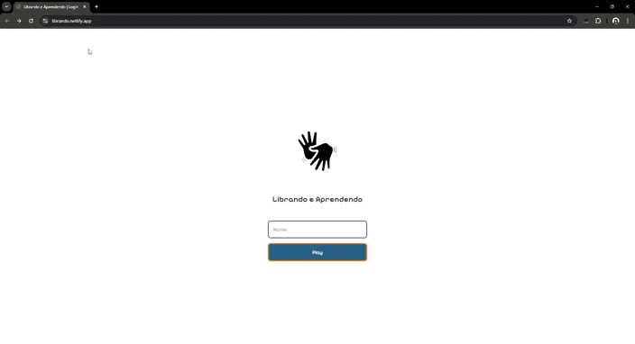

# Librando e Aprendendo
 * Jogo da Memória em Libras para aprender e se divertir
## Descrição:
O librando-e-aprendendo é um jogo educativo e divertido que tem como objetivo facilitar o aprendizado da Língua Brasileira de Sinais (Libras). Através de um clássico jogo da memória, o jogador é apresentado a pares de cartas contendo palavras em português e seus respectivos sinais em Libras.
### Público-alvo
Crianças, adolescentes, adultos e qualquer pessoa interessada em aprender Libras.
### Funcionalidades
* Pares de cartas: Cada par apresenta uma palavra em português e sua representação em Libras.
* Mecânica simples: Clique nas cartas para virá-las e encontrar os pares iguais.

### Tecnologias Utilizadas:
 * Front-end: HTML, CSS, JavaScript
#### Instalação:
 * O jogo está disponível online em: librando.netlify.app
##### Como Jogar:
 * Objetivo: Encontre todos os pares de cartas iguais.
 * Mecânica: Clique em uma carta para virá-la. Se encontrar o par correspondente, ele permanecerá visível. Caso contrário, as cartas serão viradas novamente.
 * Controles: Utilize o mouse para interagir com as cartas.
### Licença
[MIT License]
-Este projeto está licenciado sob a [MIT License].
### Autores
* Thaina L. Rossinoli - Desenvolvedor, Designer, Artista.

### Agradecimentos
Gostaria de agradecer ao professor Everaldo pelo apoio e incentivo na criação deste projeto.

### Observações:
* Imagens: Adicione imagens ou GIFs do jogo para torná-lo mais atrativo.
* Vídeo: Se tiver um vídeo demonstrando o jogo, inclua o link.
* Contribuições: Se aceitar contribuições, adicione uma seção explicando como os outros podem colaborar.
* Melhorias futuras: Otimização, para mobile, e criar mais jogos dentro.
